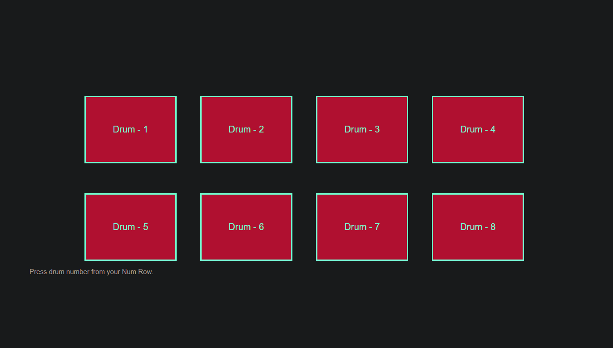

<h1>Project Drum Kit</h1>
<!-- <h2>Made by Ujjawal Maurya</h2> -->

## Document version Control

<table border>
<th>Date Issued</th>
<th>Version</th>
<th>Description</th>
<th>Author</th>
<tr>
<td>07-01-2023</td>
<td>0.1.0</td>
<td>Initially pushed complete project</td>
<td>Ujjawal</td>
</tr>

<tr>
<td>09-01-2023</td>
<td>0.1.0</td>
<td>Added Low Level Docs</td>
<td>Ujjawal</td>
</tr>

<!-- <tr>
<td>0-01-2023</td>
<td>0.1.2</td>
<td>Fixed some bugs</td>
<td>Ujjawal</td>
</tr> -->

</tr>
</table>

 

## Contents

Document Version Control

### Abstract

<ol>
    <li>
    Introduction
        <ul>
            <li>1.1 Introduction</li>
            <!-- <li>1.2 </li> -->
        </ul>
    </li>
    <li>
    Technical Specs
        <ul>
            <li>2.1 - Predicting Outcome </li>
            <li>2.2 - Logging </li>
            <li>2.3 - Database </li>
            <li>2.4 - Deployment </li>
        </ul>
    </li>
    <li>Technology Stack</li>
    <li>Proposed Solution</li>
    <li>Model training/validation workflow</li>
    <li>User I/O workflow</li>
    <li>Exceptional scenarios</li>
    <li>Test cases</li>
    <li>Key performance indicators (KPI)</li>
</ol>

## Introduction

The purpose of this document is to present a detailed description of this Project workflow.
It will explain the purpose and features of the system, the interfaces of the system, what the
system will do, the constraints under which it must operate and how the system will react to
external stimuli. This document is intended for both the stakeholders and the developers of
the system and will be proposed to the higher management for its approval.

## Technical Specs

<ul>
    <li>
        User will able to see all brums in from of Buttons as of now.
    </li>
    <li>
        Clicking on them will produce sound.
    </li>
    <li>
        Keymapping will be there for better experience of playing drum.
    </li>
    <li>
        NumRow will be used to trigger drum sound events.
    </li>
</ul>

## Logging

<ul>
    <li>
    The System identifies at what step logging required
    </li>
    <li>
    The System should be able to log each and every system flow.</li>
</ul>

## Databse

No databse Required

## Deployment

Deployed on Github Pages

## Preview

